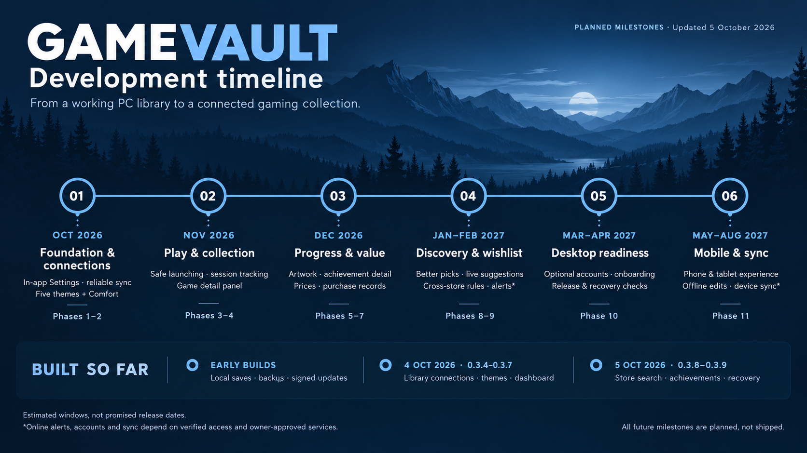

# GameVault

Your personal gaming library, with local saves, cover artwork and playtime tracking.

**[Download GameVault 0.3.9 for Windows](https://github.com/ShadowSwaps/GameVault-Downloads/releases/download/v0.3.9/GameVault_0.3.9_x64-setup.exe)** · [Release notes](https://github.com/ShadowSwaps/GameVault-Downloads/releases/latest) · [All releases](https://github.com/ShadowSwaps/GameVault-Downloads/releases)

## What you can do today

- Organize games with favorites, tags, ratings, notes, shelves and grid/list views.
- Import your owned Steam library and installed PC games from Epic Games, Ubisoft Connect, GOG, EA app and Battle.net, with review before saving.
- Use SteamGridDB as the only automatic game-cover provider, or choose your own images. Artwork is saved for offline use.
- Track sessions, playtime and achievements. Steam achievement icons and global rarity percentages are cached, with Achievements beside Games on the left.
- Search Steam, Epic Games and GOG from Wishlist, choose a region, then save exact products with optional sale notifications and 5-100% discount thresholds.
- Use one dashboard with recommendations, recent sessions and visible artwork/achievement progress with Stop. GameVault 0.3.9 fixes the empty dashboard after recovery and Steam reconnection without requiring a restart.
- Choose Gaming, Dark, Light, Cozy or Calm, and five core interface languages.

Your collection stays on your device. Accounts, mobile sync, Comfort mode, the planned in-app Settings panel and closed-app/email alerts are future roadmap work. Current sale alerts run while GameVault is open; GameVault does not change online store wishlists. Library imports preserve saved notes, artwork, ratings and sessions.

## Development roadmap

The expanded roadmap is our working plan: **11 phases, 48 items and 41 research topics**. The timeline groups major updates into estimated windows; every future milestone remains planned until its completion checks pass.

[Milestone details and estimate assumptions](docs/ROADMAP.md) · [Full development roadmap (PDF)](docs/roadmap/GameVault_Development_Roadmap.pdf)

## Install and update

1. Download and run the Windows x64 installer, then open **GameVault** from the Start menu.
2. Add games manually, import a CSV, or connect Steam and supported installed-game libraries.
3. Use **Settings → Export backup** to keep an external copy of your collection.

Updater-enabled 0.3.2 installations can update directly to 0.3.9 through **Settings → Check for updates → Update and restart**. Finish a running session first. Browser copies and desktop previews need one manual installation of the public release to enable updates. Setup may need internet to install WebView2 if it is missing; your saved collection works offline after installation.

## Release evidence and help

The 0.3.9 production Windows build passed **701 checks**; its separate Windows preview passed **693**. These are separate run totals. The final installer was verified with GameVault's permanent updater key, and the four public files and update feed were independently checked. These checks do not replace remaining real-account and wider Windows compatibility checks.

Windows publisher certificate signing remains unconfigured, so Windows may show an unknown-publisher prompt. The updater signature verifies update packages.

See the [0.3.9 release](https://github.com/ShadowSwaps/GameVault-Downloads/releases/tag/v0.3.9) for the installer, release notes, signature and checksums. Earlier version history is retained in [all releases](https://github.com/ShadowSwaps/GameVault-Downloads/releases).

For a problem report, include the GameVault version, Windows version, action, expected result and actual result. Share personal collection data only when necessary. Planned in-app Feedback and Bug Report destinations will be agreed before implementation.
